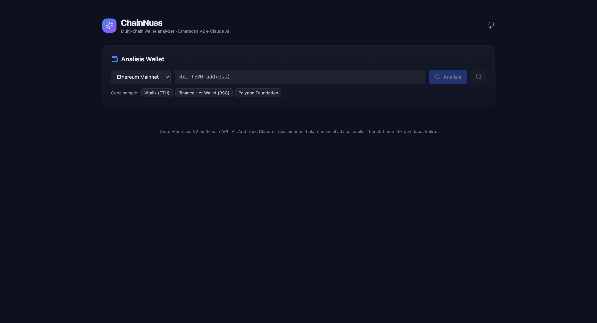
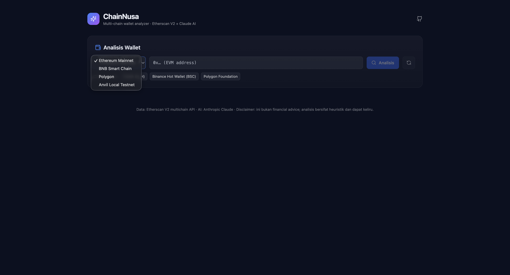
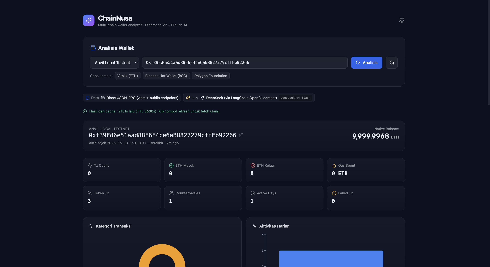
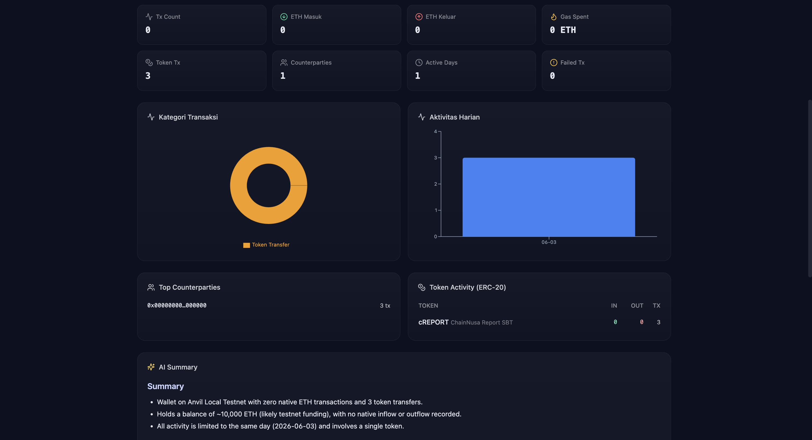
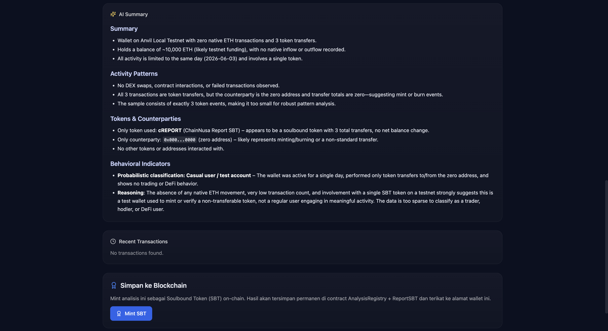

<picture>
  <source media="(prefers-color-scheme: dark)" srcset="assets/01_BANNER_DARK.png">
  <source media="(prefers-color-scheme: light)" srcset="assets/02_BANNER_LIGHT.png">
  
</picture>

<p align="center">
  
</p>

# ChainNusa — Crypto Wallet Analyzer

> Platform intelijen on-chain untuk Asia Tenggara.
> Penganalisis wallet multi-chain dengan ringkasan AI. Didukung oleh **Etherscan V2 / JSON-RPC + Claude / DeepSeek / Ollama**.

Input: `alamat wallet` + `chain` → Output: analisis pola transaksi + ringkasan AI dalam bahasa alami.

---

## Fitur

- **Pluggable providers (pola adapter)** — ganti sumber data & LLM via env, tanpa ubah kode:
  - Data: **Etherscan V2** (hosted, full history) ↔ **Direct JSON-RPC** (self-hosted via viem, hanya ERC-20)
  - LLM: **Claude** (hosted) ↔ **DeepSeek** (hosted) ↔ **Ollama** (lokal) — semua via LangChain
- **Multi-chain** — Ethereum, BSC, Polygon, Anvil Local Testnet (via Etherscan V2 multichain atau direct JSON-RPC).
- **Data pipeline**:
  - Ambil native balance + 500 tx terakhir + 500 transfer ERC-20 terakhir (paralel).
  - Kategorisasi heuristik: transfer / contract / DEX swap (methodId) / failed / self.
  - Agregasi: total in/out, gas spent, top counterparties, ringkasan token, aktivitas harian.
- **Orkestrasi LLM via LangChain** (`ChatPromptTemplate` + `RunnableSequence` + `StringOutputParser`) — system prompt anti-halusinasi, output terstruktur.
- **Cache SQLite** — wallet yang sudah di-scan dilayani dari cache (TTL 1 jam, dapat dikonfigurasi). Tombol force-refresh di UI.
- **Smart contract on-chain** — simpan hasil analisis sebagai Soulbound Token (SBT) via AnalysisRegistry + ReportSBT.
- **UI** — Next.js 14 + Tailwind + Recharts + Lucide. Tema gelap, responsif, badge provider real-time.

---

## Tampilan Aplikasi

### Halaman Utama


Tampilan awal ChainNusa. Masukkan alamat wallet EVM, pilih jaringan, klik **Analisis**.

### Pilih Jaringan


Dropdown jaringan mendukung **Ethereum (1)**, **BSC (56)**, **Polygon (137)**, dan **Anvil Local Testnet (31337)** untuk development.

### Hasil Analisis — Ringkasan & Statistik


Setelah analisis selesai, ditampilkan:
- **Header** — alamat wallet, native balance, info chain
- **Stat Grid** — jumlah tx, native in/out, gas spent, token tx, counterparties, active days
- **Tombol Mint SBT** — simpan hasil analisis ke blockchain sebagai Soulbound Token

### Kategori Transaksi & Aktivitas Harian


Dua panel visualisasi:
- **Pie Chart** — kategori transaksi (transfer, contract interaction, DEX swap, failed, self)
- **Bar Chart** — aktivitas harian (jumlah tx per hari, 30 hari terakhir)

### Ringkasan AI


LLM (DeepSeek / Claude / Ollama) menghasilkan analisis naratif dalam format Markdown:
- **Summary** — gambaran umum wallet
- **Activity Patterns** — pola transaksi & pengeluaran
- **Tokens & Counterparties** — token dan kontrak yang sering berinteraksi
- **Behavioral Indicators** — klasifikasi probabilistik (trader / hodler / DeFi user / casual)

---

## Stack

```
Sumber Data   → Etherscan V2 API  ↔  Direct JSON-RPC (viem + RPC publik)
Penyimpanan   → SQLite (better-sqlite3) — berbasis file, tanpa infrastruktur
Lapisan LLM   → LangChain (ChatAnthropic ↔ ChatOpenAI ↔ ChatOllama)
Backend       → Next.js Route Handlers (Node runtime)
Frontend      → Next.js 14 App Router + Tailwind + Recharts
```

### Matriks Provider

| Mode                    | Data         | LLM      | API key dibutuhkan     | Privasi              |
| ----------------------- | ------------ | -------- | ---------------------- | -------------------- |
| **Hosted** (default)    | Etherscan V2 | Claude   | Etherscan + Anthropic  | Data pihak ketiga    |
| **DeepSeek**            | Etherscan V2 | DeepSeek | Etherscan + DeepSeek   | Data pihak ketiga    |
| **Hybrid A**            | Etherscan V2 | Ollama   | Hanya Etherscan        | LLM lokal            |
| **Hybrid B**            | RPC          | Claude   | Hanya Anthropic        | Data via RPC         |
| **Fully self-hosted**   | RPC          | Ollama   | _tidak ada_            | 100% lokal           |

---

## Setup

### 1. Prasyarat

- Node.js 18.18+ atau 20+, pnpm 10+
- Kunci API sesuai mode (lihat tabel di atas) — bisa _tanpa_ untuk RPC + Ollama.

### 2. Install

```bash
pnpm install
```

`better-sqlite3` adalah modul native — membutuhkan build tools (Xcode CLT di macOS, build-essential di Linux). pnpm auto-build via `onlyBuiltDependencies`.

### 3. Konfigurasi env

```bash
cp apps/web/.env.example apps/web/.env.local
```

Edit `.env.local`. Pilih kombinasi sesuai matriks:

```ini
# Default (hosted)
DATA_PROVIDER=etherscan
LLM_PROVIDER=claude
ETHERSCAN_API_KEY=...
ANTHROPIC_API_KEY=...

# atau DeepSeek
DATA_PROVIDER=etherscan
LLM_PROVIDER=deepseek
DEEPSEEK_API_KEY=sk-...
DEEPSEEK_MODEL=deepseek-chat

# atau Fully self-hosted
DATA_PROVIDER=rpc
LLM_PROVIDER=ollama
OLLAMA_BASE_URL=http://localhost:11434
OLLAMA_MODEL=qwen2.5:7b
```

### 4. Jalankan

```bash
pnpm web:dev
```

Buka http://localhost:3000 — badge di hasil analisis menampilkan provider yang aktif.

### 5. Build production

```bash
pnpm web:build && pnpm web:start
```

---

## Mode Self-Hosted (Ollama + RPC)

### Opsi A: Docker Compose (disarankan)

```bash
cp apps/web/.env.example apps/web/.env.local
# atur DATA_PROVIDER=rpc dan LLM_PROVIDER=ollama di .env.local
docker compose up -d

# Pull model di container ollama:
docker compose exec ollama ollama pull qwen2.5:7b
```

Aplikasi di `http://localhost:3000`, Ollama di `http://localhost:11434`. Data disimpan di volume `chainnusa-data` & `ollama-models`.

### Opsi B: Instalasi Ollama native

```bash
# macOS / Linux:
curl -fsSL https://ollama.com/install.sh | sh
ollama serve &
ollama pull qwen2.5:7b   # atau llama3.1:8b, mistral, dll.

# di repo ini:
# .env.local -> LLM_PROVIDER=ollama, DATA_PROVIDER=rpc
pnpm web:dev
```

### Model lokal yang direkomendasikan

| Model         | Ukuran | Keunggulan             | Bahasa Indonesia |
| ------------- | ------ | ---------------------- | ---------------- |
| `qwen2.5:7b`  | ~4.7GB | Cepat, seimbang        | Baik             |
| `llama3.1:8b` | ~4.9GB | Penalaran kuat         | Cukup            |
| `mistral:7b`  | ~4.1GB | Ringkas                | Memadai          |
| `qwen2.5:14b` | ~9GB   | Lebih akurat           | Sangat baik      |

---

## API

### `POST /api/analyze`

Request:

```json
{
  "address": "0xd8da6bf26964af9d7eed9e03e53415d37aa96045",
  "chainId": 1,
  "forceRefresh": false
}
```

`chainId`: `1` (Ethereum), `56` (BSC), `137` (Polygon), `31337` (Anvil Local Testnet).

Response (200):

```json
{
  "ok": true,
  "cached": false,
  "analysis": {
    "chainId": 1,
    "chainName": "Ethereum Mainnet",
    "nativeSymbol": "ETH",
    "address": "0x...",
    "totals": {
      "nativeBalance": "1.234",
      "nativeIn": "100.5",
      "nativeOut": "98.2",
      "gasSpent": "0.42",
      "txCount": 500,
      "tokenTxCount": 312,
      "failedTxCount": 4,
      "uniqueCounterparties": 87,
      "firstTxAt": 1620000000,
      "lastTxAt": 1759999999,
      "activeDays": 145
    },
    "categories": [{ "category": "dex_swap", "count": 42 }],
    "topCounterparties": [
      { "address": "0x...", "interactions": 12, "isContract": true }
    ],
    "tokens": [
      {
        "symbol": "USDC",
        "totalIn": "1000",
        "totalOut": "500",
        "transferCount": 12
      }
    ],
    "dailyActivity": [
      { "date": "2024-01-01", "txCount": 5, "nativeIn": 0.1, "nativeOut": 0 }
    ],
    "sampleTxs": []
  },
  "aiSummary": "## Summary\n- ..."
}
```

Error (4xx/5xx):

```json
{ "ok": false, "error": "Alamat EVM tidak valid ..." }
```

### `POST /api/record-analysis`

Mencatat hasil analisis ke blockchain dan mint SBT.

Request:

```json
{
  "address": "0xf39Fd6e51aad88F6F4ce6aB8827279cffFb92266",
  "chainId": 31337,
  "analysis": { ... }
}
```

Response (200):

```json
{
  "ok": true,
  "analysisId": "0x...",
  "sbtTokenId": "1",
  "registryTxHash": "0x...",
  "sbtTxHash": "0x..."
}
```

---

## Struktur Proyek

```
apps/web/                              # Next.js 14 App Router
├── src/
│   ├── app/api/analyze/route.ts       # POST endpoint, factory-driven
│   ├── app/api/record-analysis/        # On-chain SBT minting endpoint
│   ├── components/                    # Analyzer, Charts, MarkdownLite
│   └── lib/
│       ├── analyzer.ts                # Agregasi + kategorisasi heuristik
│       ├── chains.ts                  # Registri chain (ETH, BSC, Polygon, Anvil)
│       ├── db.ts                      # SQLite + skema
│       ├── cache.ts                   # Cache & riwayat scan
│       ├── contracts.ts               # Interaksi smart contract (viem)
│       ├── ml-client.ts               # Klien ML service
│       └── providers/                 # Pola adapter: data + llm
├── Dockerfile
└── package.json

ml-service/                            # Python FastAPI
├── app/
│   ├── main.py                        # Entry point API
│   ├── routers/                       # /predict, /explain, /cluster
│   ├── models/                        # RF/XGBoost, IsolationForest, LSTM
│   ├── features/extractor.py          # 30+ fitur wallet
│   └── etl/                           # Extract → Transform → Load
├── notebooks/                         # 8 Jupyter notebooks
├── tests/
├── Dockerfile
└── pyproject.toml

contracts/                             # Solidity (Foundry)
├── src/AnalysisRegistry.sol           # Registri CID on-chain
├── src/ReportSBT.sol                  # Soulbound NFT
├── src/governance/MultiSigGovernor.sol # Adaptor governance
├── src/multisig/MultiSigWallet.sol    # Wallet multi-signature
├── test/
├── script/Deploy.s.sol
└── foundry.toml

infra/                                 # Docker Compose
├── docker-compose.yml                 # PostgreSQL 16, MinIO, MLflow, Prometheus, Grafana
├── prometheus/prometheus.yml
└── grafana/

docs/                                  # Dokumentasi
├── contracts-overview.md              # Arsitektur smart contract
├── tutorial-analysis-registry.md      # Tutorial AnalysisRegistry
├── tutorial-report-sbt.md             # Tutorial ReportSBT
├── tutorial-multisig-wallet.md        # Tutorial MultiSigWallet
├── tutorial-multisig-governor.md      # Tutorial MultiSigGovernor
└── tutorial-deploy.md                 # Panduan deploy
```

---

## Keterbatasan

### Mode `etherscan`

- Hanya mengambil **500 tx terakhir** dan **500 transfer token terakhir** per scan untuk menghemat rate limit gratis (5 req/detik).
- Kategorisasi DEX swap berdasarkan **methodId router yang dikenal** (Uniswap V2/V3 + multicall). DEX lain mungkin diklasifikasikan sebagai _contract_interaction_.

### Mode `rpc`

- **Tidak ada riwayat tx native** — JSON-RPC tidak memiliki endpoint "txlist by address". Hanya event ERC-20 Transfer via `eth_getLogs` (diindeks berdasarkan topic).
- Rentang blok terbatas pada `RPC_LOG_BLOCK_RANGE` blok terakhir (default 10k ≈ ~1.5 jam di ETH).
- RPC publik mungkin membatasi rate; provider otomatis fallback ke endpoint berikutnya.

### Mode `ollama`

- Latensi tergantung perangkat keras lokal. `qwen2.5:7b` di Mac seri-M ~5-15 detik per request.
- Kualitas output bervariasi berdasarkan ukuran model — coba `qwen2.5:14b` untuk kualitas lebih tinggi.

### Umum

- Ringkasan AI bersifat **heuristik**. Bukan saran keuangan.

---

## Lisensi

MIT — lihat `LICENSE`.
