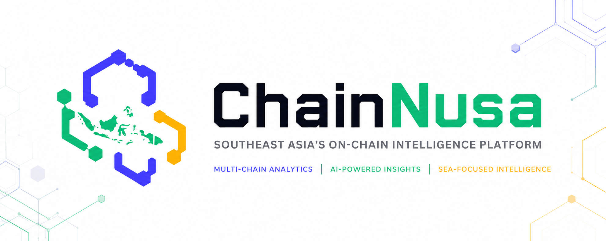
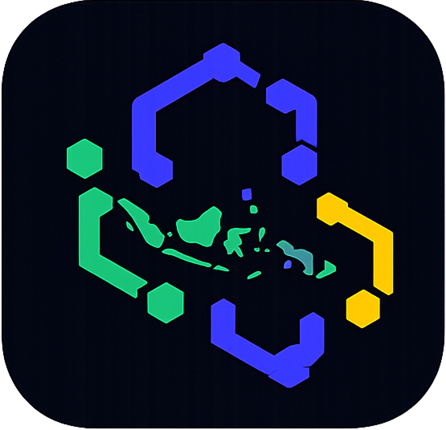

<picture>
  <source media="(prefers-color-scheme: dark)" srcset="assets/01_BANNER_DARK.png">
  <source media="(prefers-color-scheme: light)" srcset="assets/02_BANNER_LIGHT.png">
  
</picture>

<p align="center">
  
</p>

<p align="center">
  <a href="README.md">🇬🇧 English</a>
</p>

# ChainNusa — Crypto Wallet Analyzer

> On-chain intelligence platform untuk Asia Tenggara.
> Multi-chain wallet analyzer dengan AI summary. Powered by **Etherscan V2 + Claude (Anthropic)**.

Input: `wallet address` + `chain` → Output: analisis pola spending + ringkasan AI natural language (Bahasa Indonesia).

---

## Fitur

- **Pluggable providers (adapter pattern)** — swap data source & LLM via env, tanpa ubah kode:
  - Data: **Etherscan V2** (hosted, full history) ↔ **Direct JSON-RPC** (self-hosted via viem, ERC-20 only)
  - LLM: **Claude** (hosted, via LangChain) ↔ **Ollama** (lokal, via LangChain)
- **Multi-chain** — Ethereum, BSC, Polygon (via Etherscan V2 multichain atau viem chains).
- **Pipeline data**:
  - Fetch native balance + last 500 tx + last 500 ERC-20 transfers (paralel).
  - Heuristic categorization: transfer/contract/DEX swap (methodId)/failed/self.
  - Aggregation: total in/out, gas spent, top counterparties, token summary, daily activity.
- **LLM orchestration via LangChain** (`ChatPromptTemplate` + `RunnableSequence` + `StringOutputParser`) — system prompt anti-hallucination, output Bahasa Indonesia terstruktur.
- **Caching SQLite** — wallet yang sudah pernah di-scan dilayani dari cache (TTL 1 jam, configurable). Force-refresh button di UI.
- **UI** — Next.js 14 + Tailwind + Recharts + Lucide. Dark theme, responsive, badge provider info real-time.

---

## Stack

```
Data Source   → Etherscan V2 API  ↔  Direct JSON-RPC (viem + public RPC)
Storage       → SQLite (better-sqlite3) — file-based, zero infra
LLM Layer     → LangChain (ChatAnthropic ↔ ChatOllama)
Backend       → Next.js Route Handlers (Node runtime)
Frontend      → Next.js 14 App Router + Tailwind + Recharts
```

### Provider matrix

| Mode                  | Data         | LLM    | API key needed        | Privasi              |
| --------------------- | ------------ | ------ | --------------------- | -------------------- |
| **Hosted** (default)  | Etherscan V2 | Claude | Etherscan + Anthropic | Data ke pihak ke-3   |
| **Hybrid A**          | Etherscan V2 | Ollama | Etherscan only        | LLM lokal            |
| **Hybrid B**          | RPC          | Claude | Anthropic only        | Data via RPC         |
| **Fully self-hosted** | RPC          | Ollama | _none_                | 100% lokal           |

---

## Setup

### 1. Prasyarat

- Node.js 18.18+ atau 20+, pnpm 10+
- API key sesuai mode (lihat tabel di atas) — bisa _none_ kalau pakai RPC + Ollama.

### 2. Install

```bash
pnpm install
```

`better-sqlite3` adalah native module — butuh build tools (Xcode CLT di macOS, build-essential di Linux). pnpm auto-build via `onlyBuiltDependencies`.

### 3. Konfigurasi env

```bash
cp .env.example .env
```

Edit `.env`. Pilih kombinasi sesuai matrix:

```ini
# Default (hosted)
DATA_PROVIDER=etherscan
LLM_PROVIDER=claude
ETHERSCAN_API_KEY=...
ANTHROPIC_API_KEY=...

# atau Fully self-hosted
DATA_PROVIDER=rpc
LLM_PROVIDER=ollama
OLLAMA_BASE_URL=http://localhost:11434
OLLAMA_MODEL=qwen2.5:7b
```

### 4. Jalankan

```bash
pnpm dev
```

Buka http://localhost:3000 — badge di hasil analisis akan menunjukkan provider aktif.

### 5. Production build

```bash
pnpm build && pnpm start
```

---

## Mode Self-Hosted (Ollama + RPC)

### Opsi A: Docker Compose (recommended)

```bash
cp .env.example .env
# set DATA_PROVIDER=rpc dan LLM_PROVIDER=ollama di .env
docker compose up -d

# Pull model di container ollama:
docker compose exec ollama ollama pull qwen2.5:7b
```

App di `http://localhost:3000`, Ollama di `http://localhost:11434`. Data persistent di volume `chainnusa-data` & `ollama-models`.

### Opsi B: Native install Ollama

```bash
# macOS / Linux:
curl -fsSL https://ollama.com/install.sh | sh
ollama serve &
ollama pull qwen2.5:7b   # atau llama3.1:8b, mistral, dll

# di repo ini:
# .env -> LLM_PROVIDER=ollama, DATA_PROVIDER=rpc
pnpm dev
```

### Rekomendasi model lokal

| Model         | Size   | Kekuatan       | Bahasa Indonesia |
| ------------- | ------ | -------------- | ---------------- |
| `qwen2.5:7b`  | ~4.7GB | Fast, balanced | Bagus            |
| `llama3.1:8b` | ~4.9GB | Reasoning kuat | Decent           |
| `mistral:7b`  | ~4.1GB | Concise        | Cukup            |
| `qwen2.5:14b` | ~9GB   | Lebih akurat   | Sangat bagus     |

---

## API

### `POST /api/analyze`

Request:

```json
{
  "address": "0xd8da6bf26964af9d7eed9e03e53415d37aa96045",
  "chainId": 1,
  "forceRefresh": false
}
```

`chainId`: `1` (Ethereum), `56` (BSC), `137` (Polygon).

Response (200):

```json
{
  "ok": true,
  "cached": false,
  "analysis": {
    "chainId": 1,
    "chainName": "Ethereum Mainnet",
    "nativeSymbol": "ETH",
    "address": "0x...",
    "totals": {
      "nativeBalance": "1.234",
      "nativeIn": "100.5",
      "nativeOut": "98.2",
      "gasSpent": "0.42",
      "txCount": 500,
      "tokenTxCount": 312,
      "failedTxCount": 4,
      "uniqueCounterparties": 87,
      "firstTxAt": 1620000000,
      "lastTxAt": 1759999999,
      "activeDays": 145
    },
    "categories": [{ "category": "dex_swap", "count": 42 }],
    "topCounterparties": [
      { "address": "0x...", "interactions": 12, "isContract": true }
    ],
    "tokens": [
      {
        "symbol": "USDC",
        "totalIn": "1000",
        "totalOut": "500",
        "transferCount": 12
      }
    ],
    "dailyActivity": [
      { "date": "2024-01-01", "txCount": 5, "nativeIn": 0.1, "nativeOut": 0 }
    ],
    "sampleTxs": []
  },
  "aiSummary": "## Ringkasan\n- ..."
}
```

Error (4xx/5xx):

```json
{ "ok": false, "error": "Invalid EVM address ..." }
```

---

## Struktur Proyek

```
apps/web/                           # Next.js 14 App Router
├── src/
│   ├── app/api/analyze/route.ts     # POST endpoint, factory-driven
│   ├── app/api/auth/                # SIWE sign-in (nonce + verify)
│   ├── components/                  # Analyzer, Charts, MarkdownLite
│   └── lib/
│       ├── analyzer.ts              # Aggregation + categorization heuristic
│       ├── chains.ts                # Chain registry (ETH, BSC, Polygon)
│       ├── db.ts                    # SQLite + schema
│       ├── cache.ts                 # Cache & scan history
│       ├── ml-client.ts             # ML service client
│       ├── siwe.ts                  # EIP-4361 auth helpers
│       ├── contracts/               # ABI + write helpers
│       └── providers/               # Adapter pattern: data + llm
├── Dockerfile
└── package.json

ml-service/                          # Python FastAPI
├── app/
│   ├── main.py                      # API entry point
│   ├── routers/                     # /predict, /explain, /cluster
│   ├── models/                      # RF/XGBoost, IsolationForest, LSTM
│   ├── features/extractor.py        # 30+ wallet features
│   └── etl/                         # Extract → Transform → Load
├── notebooks/                       # 8 Jupyter notebooks
├── tests/
├── Dockerfile
└── pyproject.toml

contracts/                           # Solidity (Foundry)
├── src/AnalysisRegistry.sol         # On-chain CID registry
├── src/ReportSBT.sol                # Soulbound NFT
├── test/
├── script/Deploy.s.sol
└── foundry.toml

infra/                               # Docker Compose
├── docker-compose.yml               # PostgreSQL 16, MinIO, MLflow, Prometheus, Grafana
├── prometheus/prometheus.yml
└── grafana/
```

---

## Limitasi

### Mode `etherscan`

- Hanya menarik **last 500 tx** dan **last 500 token transfer** per scan untuk hemat rate-limit free tier (5 req/s).
- Kategorisasi DEX swap berbasis **methodId router yang dikenal** (Uniswap V2/V3 + multicall). DEX lain bisa terklasifikasi sebagai _contract_interaction_.

### Mode `rpc`

- **Tidak ada native tx history** — JSON-RPC tidak punya endpoint "txlist by address". Hanya ERC-20 Transfer events via `eth_getLogs` (indexed by topic).
- Block range terbatas ke `RPC_LOG_BLOCK_RANGE` blok terakhir (default 10k ≈ ~1.5 jam di ETH).
- Public RPC bisa rate-limit; provider auto-fallback ke endpoint berikutnya.

### Mode `ollama`

- Latency tergantung hardware lokal. `qwen2.5:7b` di M-series Mac ~5-15 detik per request.
- Output Bahasa Indonesia kadang kurang konsisten dibanding Claude untuk model kecil — coba `qwen2.5:14b` jika butuh kualitas lebih.

### Umum

- AI summary bersifat **heuristik**. Bukan financial advice.

---

## Lisensi

MIT — lihat `LICENSE`.
